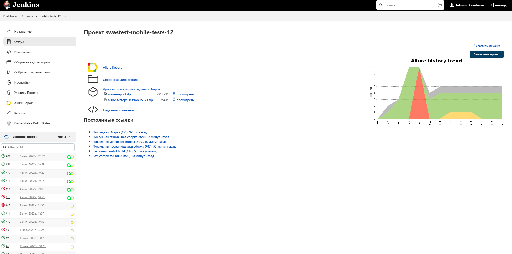
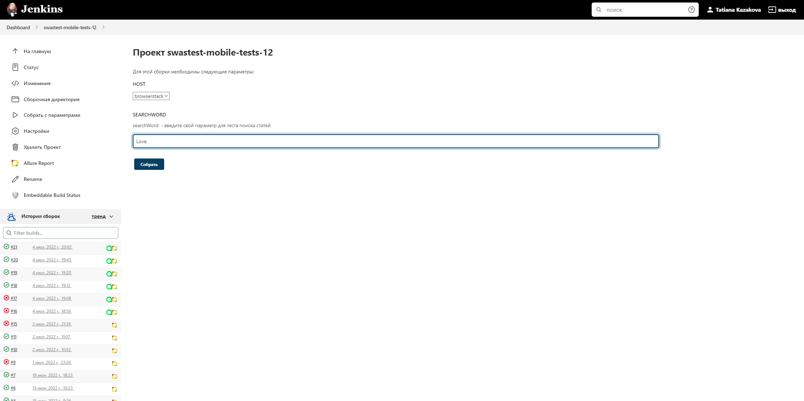
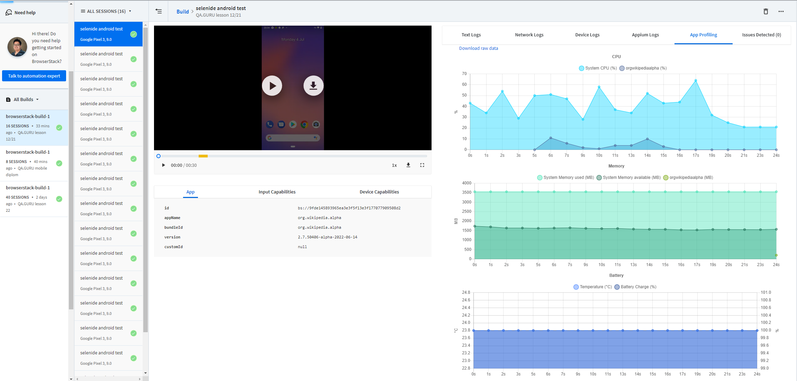
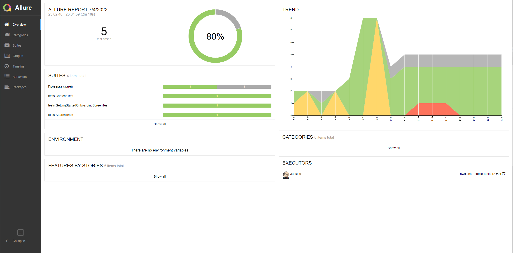
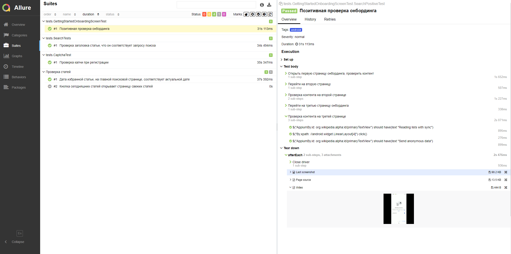
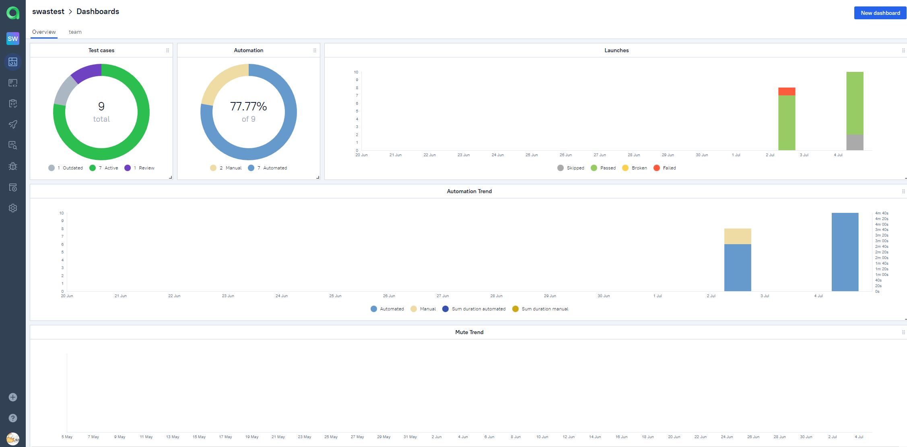
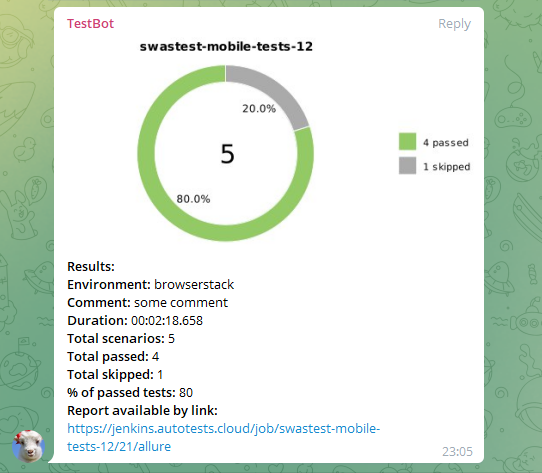
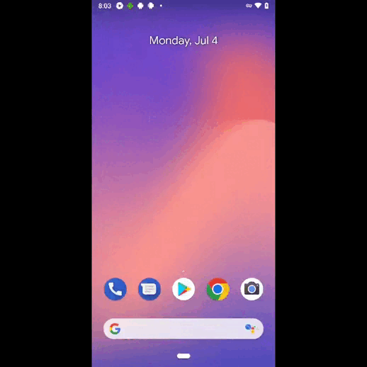

# Проект по автоматизации тестирования android-приложения  "Wikipedia"


#### <a target="_blank" href="https://github.com/wikimedia/apps-android-wikipedia/releases">Ссылка на репозиторий приложения</a>

## :floppy_disk: Содержание:

- <a href="#computer-технологии-и-инструменты">Технологии и инструменты</a>
- <a href="#notebook_with_decorative_cover-реализованные-проверки">Реализованные проверки</a>
- <a href="#electric_plug-сборка-в-Jenkins">Сборка в Jenkins</a>
- <a href="#arrow_forward-запуск-из-терминала">Запуск из терминала</a>
- <a href="#👽-отчет-browserstack">Отчет BrowserStack</a>
- <a href="#open_book-allure-отчет">Allure отчет</a>
- <a href="#hammer-allure-test-ops-отчет">Allure Test Ops отчет</a>
- <a href="#robot-отчет-в-telegram">Отчет в Telegram</a>
- <a href="#film_projector-видео-пример-прохождения-тестов">Видео пример прохождения тестов</a>

## :computer: Технологии и инструменты
<p align="center">


</p>

## :notebook_with_decorative_cover: Реализованные проверки
- Проверка онбординга
- Проверка капчи и ее атрибутов, при регистрации нового пользователя
- Проверка актуальности даты ежедневной статьи, на главной поисковой странице
- Проверка заголовка искомой статьи
- Проверка кнопки, ведущую на подборки ежедневных статей

## :electric_plug: Сборка в Jenkins
##### <a target="_blank" href="https://jenkins.autotests.cloud/job/swastest-mobile-tests-12/">Сборка в Jenkins</a>
<p align="center">

</p>  

## :arrow_forward: Запуск из терминала
Локальный запуск:
```
gradle clean android -Dhost=local
```
Запуск в Jenkins:
```
gradle clean android -Dhost=browserstack
```
## :gear: Запуск тестов с выбором параметров


## 👽 Отчет BrowserStack
Пока бегут наши тесты в Jenkins, за ними можно подсматривать в личном кабинете BrowserStack - это очень занимательно, 
а после прогона всех, нужным нам, тестов - сервис сгенерирует еще дополнительные и ценные отчеты по состоянию устройства, например.


## :open_book: Allure отчет
- ### Главный экран отчета
<p align="center">

</p>

- ### Страница с проведенными тестами
<p align="center">

</p>

## :hammer: Allure Test Ops отчет
<p align="center">

</p>

## :robot: Отчет в Telegram
<p align="center">

</p>

## :film_projector: Видео пример прохождения тестов
> К каждому тесту в отчете прилагается видео. Одно из таких видео представлено ниже.
<p align="center">
  
</p>

